# ラスタ地図を美しく表現する

## この資料について

本資料は2018年9月19日に行われた奈良文化財研究所「遺跡情報記録課程」の「GIS演習」で使用した解説資料です。

## マスターすること

- DEM データの表示を変更する。
- DEM データから新たな地形指標(ここでは陰影図)を作成する。
- DEM データと陰影図を重ねて陰影つきの段彩図を表示する。

## ドキュメント

- [配布資料](https://github.com/IshiiJunpei/QGISforArcRaster/blob/master/020%E3%83%A9%E3%82%B9%E3%82%BF%E5%9C%B0%E5%9B%B3%E3%82%92%E7%BE%8E%E3%81%97%E3%81%8F%E8%A1%A8%E7%8F%BE%E3%81%99%E3%82%8B.pdf)

-  [スライド](https://IshiiJunpei.github.io/QGISforArcRaster)

# ラスタ地図を美しく表現する

Created by Ishii Junpei ( [@ishiijunpei](https://twitter.com/ishiijunpei))

### ラスタデータを読み込む

レイヤ→レイヤの追加→ラスタレイヤの追加

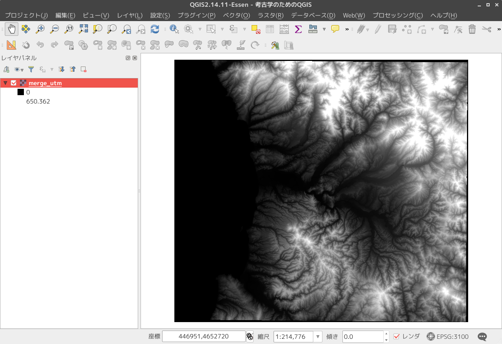

### 段彩図の作成

- 標高ラスタに色を付けます
- カラーパレットに標高を割り当てます

レイヤパネル→ラスタレイヤ（merge_utm）をダブルクリック

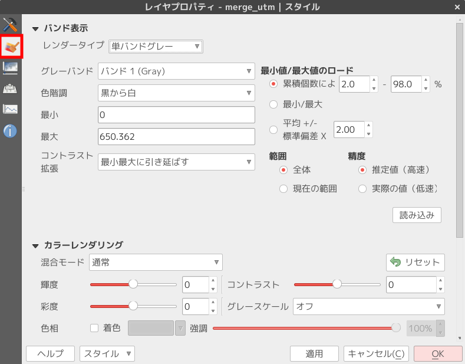

- 「レンダータイプ」のドロップリストから「単バンド疑似カラー」を選択します。
- 「新規カラーマップを作成」の下にあるドロップリストから好きなカラーマップを選びます。
- 「モード」を「等間隔」に変更します。
- 「分類数」はデフォルトは5になっていますが、まずはこれで試します。
- 「色の補完」は「離散的」を選ぶ。

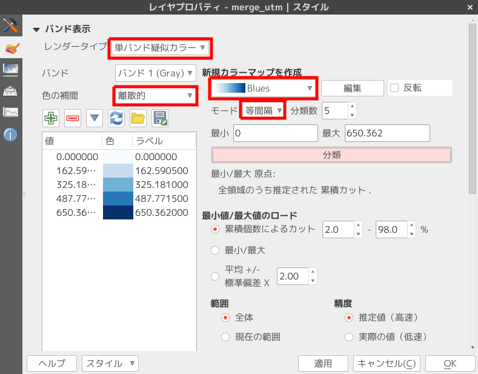

---
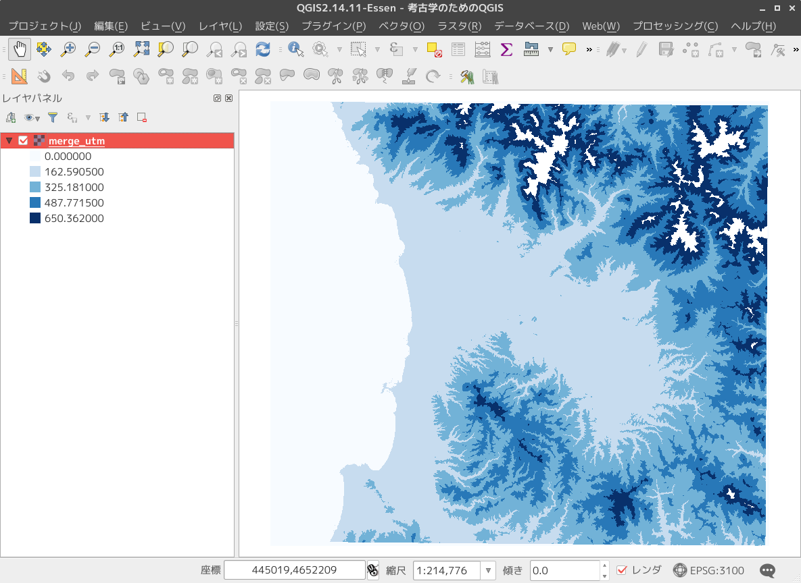

### 段彩図の見た目を変える

- カラーマップをBuGnに変更する。
- 「色の補完」を「線形」に変更する。

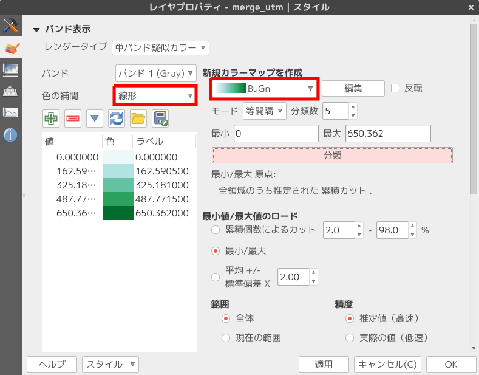

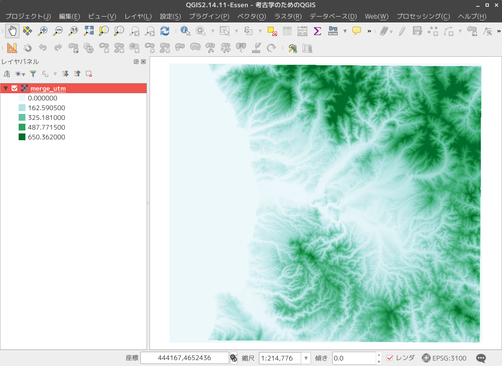

### 陰影図を作成する

標高ラスタから陰影図を作成します。

- 「ラスタ」→「地形解析」→「陰影図」
- 「標高レイヤ」はDEMデータを指定します。この場合は「merge_utm」です。
- 「出力レイヤ」は新たに作成される陰影図の保存先を指定します。

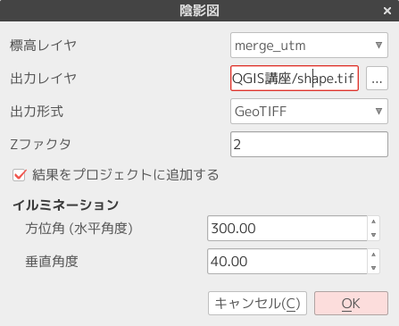

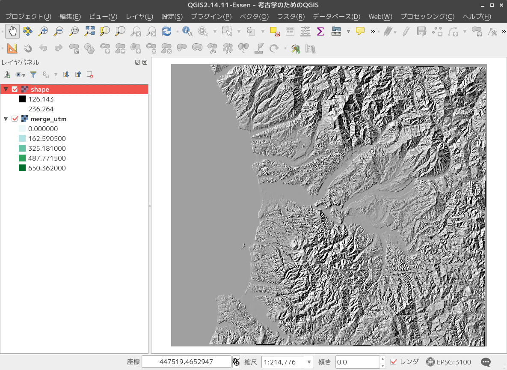

### 陰影図の透過率を変える

陰影図の透過率を変更して段彩図と陰影図が絶妙に重なった図を作成します。

- 陰影図レイヤ→ダブクリック→レイヤプロパティ→「透過性」タブ
- 「全体の透過率」のスライダーを調整します。ここでは70%に設定
	- なお、透過率は70%〜80%の間がもっとも適切に感じます。

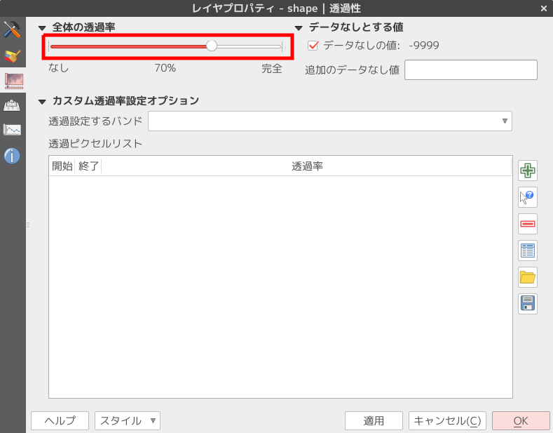

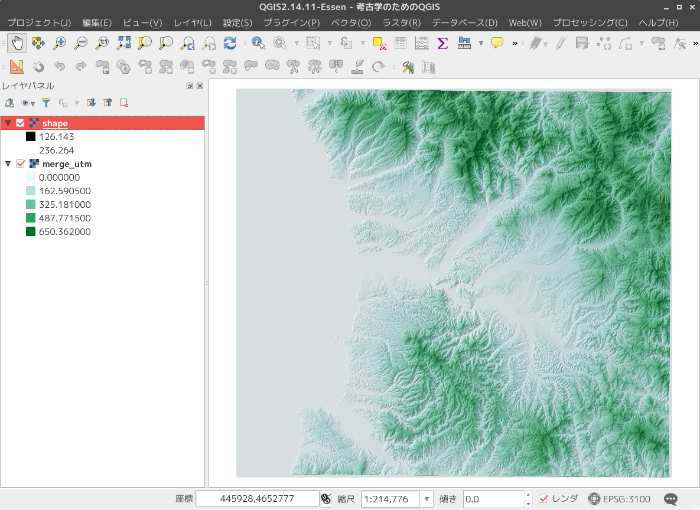

### 「乗算」による重ね合わせ

レンダリングの方法を変えることで、異なる視覚効果が得られます。

- 陰影図レイヤのレイヤプロパティを開きます。
- 「透過性」タブを開いて、「全体の透過率」を0%にします。

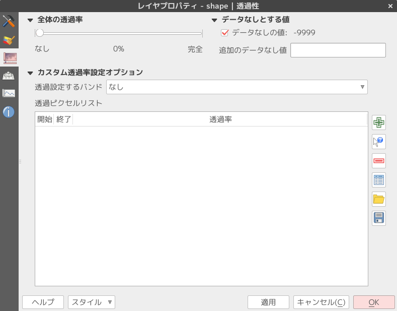

- 左側のタブの上から2番目の「スタイル」タブを開きます。
- 下の方にある「カラーレンダリング」の「混合モード」を「乗算」に設定します。

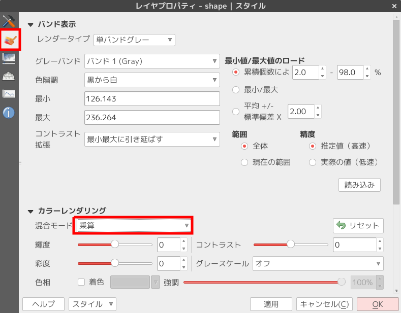

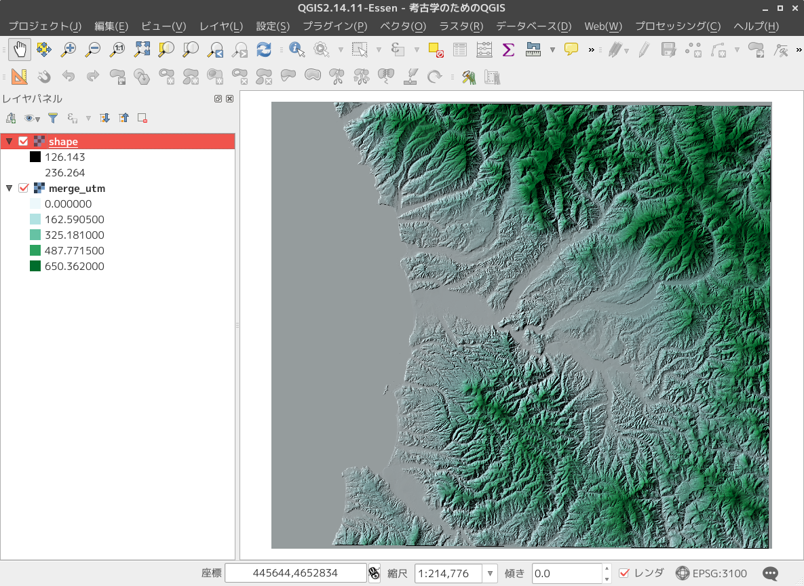

- 段彩図と陰影図の重ね合わせのバリエーション
- いくつかのバリエーションを示します。
- いろいろ試してわかりやすいラスタ地形図を作成してください。

- カラーマップをBuGn
- 「色の補完」を「離散的」
-  標高0を青に（海風に）

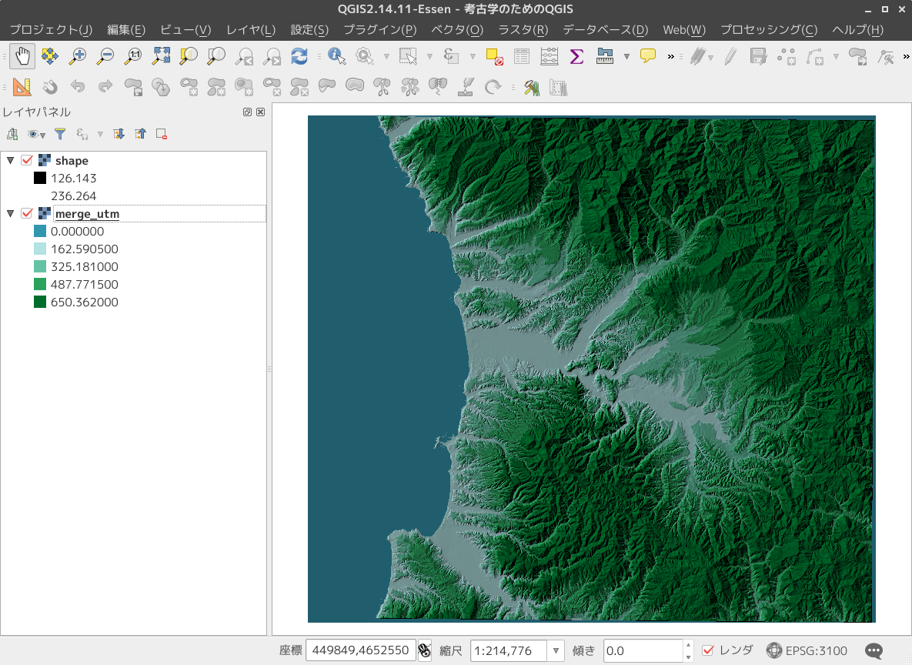

- カラーマップをSpectral
- 「色の補完」を「線形」

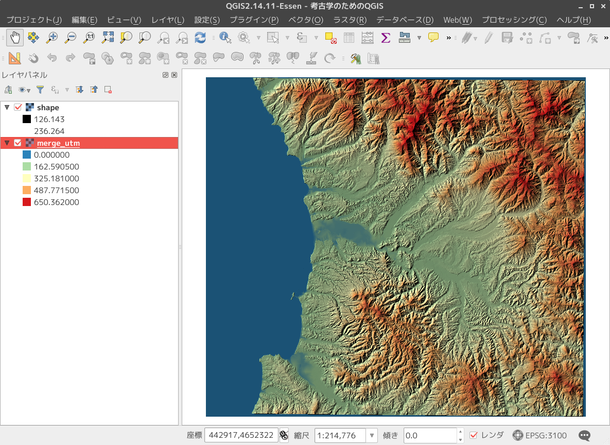

1. カラーマップをRdYlGn
2. 「色の補完」を「線形」

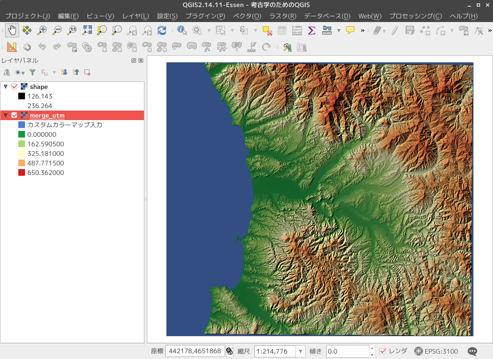

### おしまい

地形データで遊んでいると上達します。
